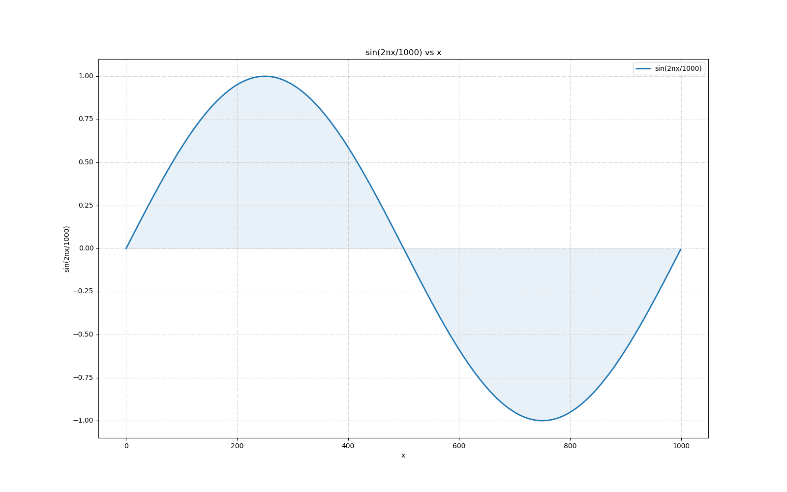
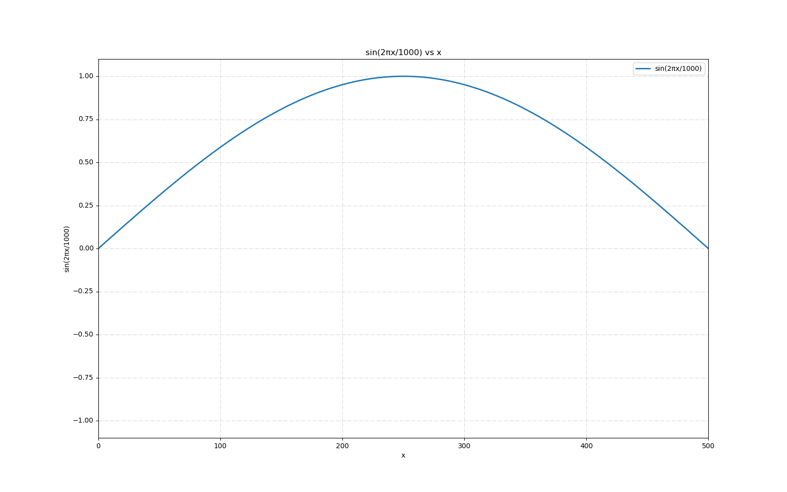
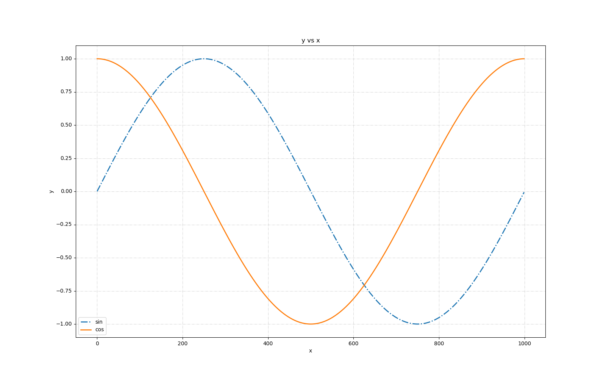
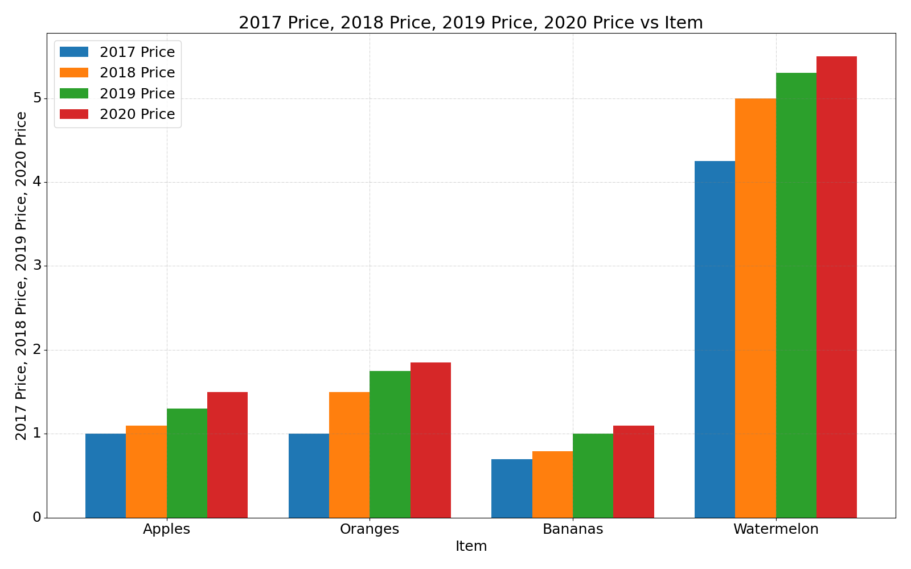
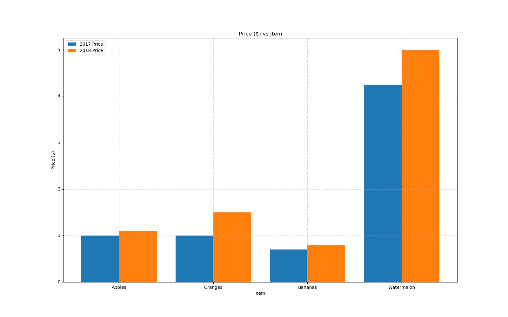
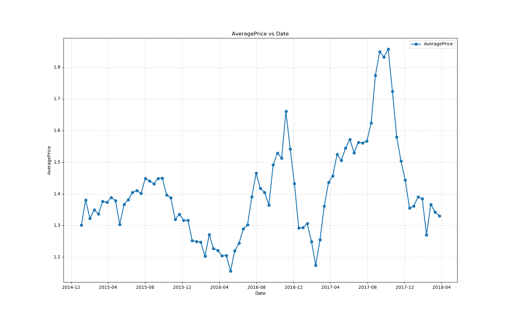
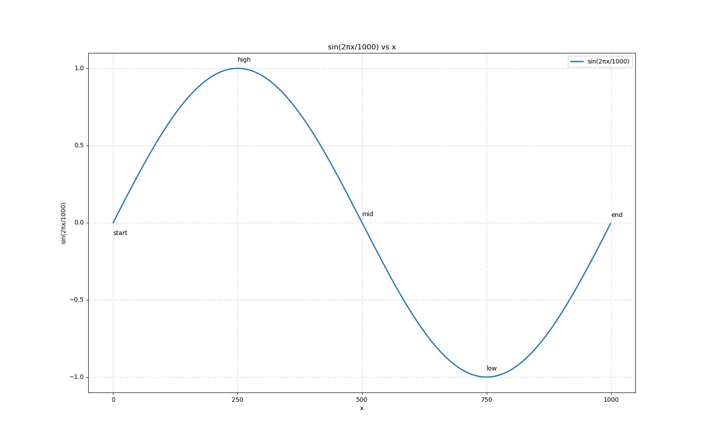
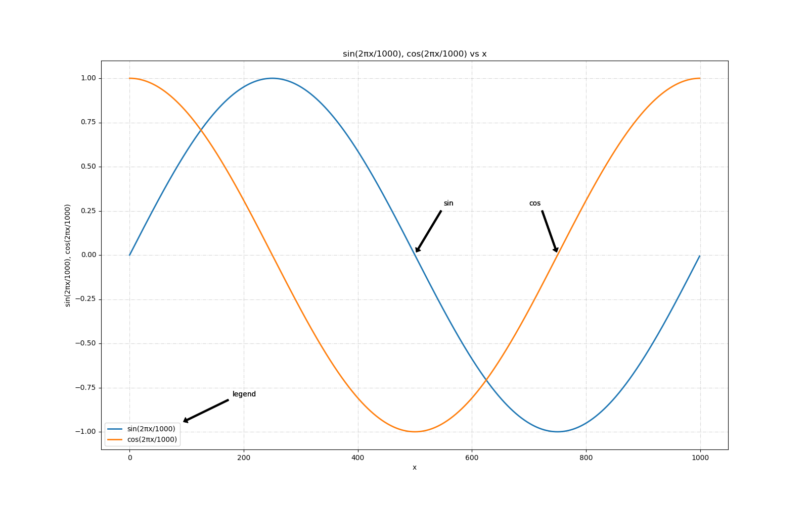

# Examples
An extended list of examples to demonstrate features and usage.

```
# example 1
graph samples/sine.csv --marker '' --fill
```



```
# example 2
graph samples/sine.csv --marker '' --xrange 0:500
```



```
# example 3
graph samples/sine-cosine.csv --marker '' --style='-.,-' --ylabel 'y' --legend 'sin,cos'
```



```
# example 4
graph samples/bar.csv --bar
```



```
# example 5
graph samples/bar.csv --bar -y 2,3 --width 0.1 --ylabel 'Price ($)'
```



```
# example 6
graph samples/avocado.csv -y 2 --resample 2W
```



```
# example 7
graph samples/sine.csv -t '0:-0.08=start' -t '250=high' -t '500=mid' -t '750=low' -t '1000=end' --marker '' --xscale 250 --yscale 0.5
```



```
# example 8
graph samples/sine-cosine.csv --marker '' --annotate '500=sin' --annotate '750=cos' --annotate '180:-0.8:90:-0.95=legend'
```



```
# example 9
graph samples/normal.csv --hist-perc --bins 15
```


