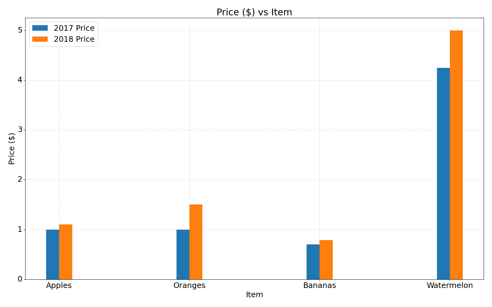

# Examples
An extended list of examples to demonstrate features and usage.

```
graph samples/sine.csv --marker '' --fill
```


```
graph samples/sine.csv --marker '' --xrange 0:500
```


```
graph samples/sine-cosine.csv --marker '' --style='-.,-' --ylabel 'y' --legend 'sin,cos'
```


```
graph samples/bar.csv --bar
```


```
graph samples/bar.csv --bar --width 0.4 --offset='-0.2,0.2' --ylabel 'Price ($)'
```



```
graph samples/avocado.csv -y 2 --resample 2W
```


```
graph samples/sine.csv -t '0:-0.08=start' -t '250=high' -t '500=mid' -t '750=low' -t '1000=end' --marker '' --xscale 250 --yscale 0.5
```


