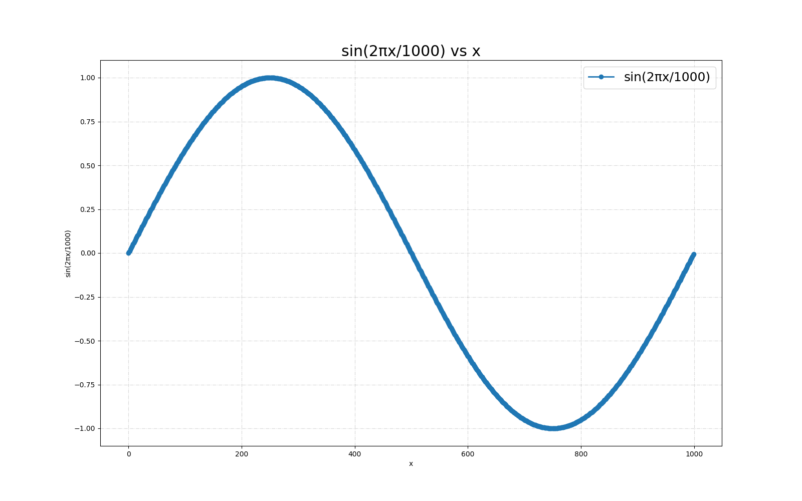
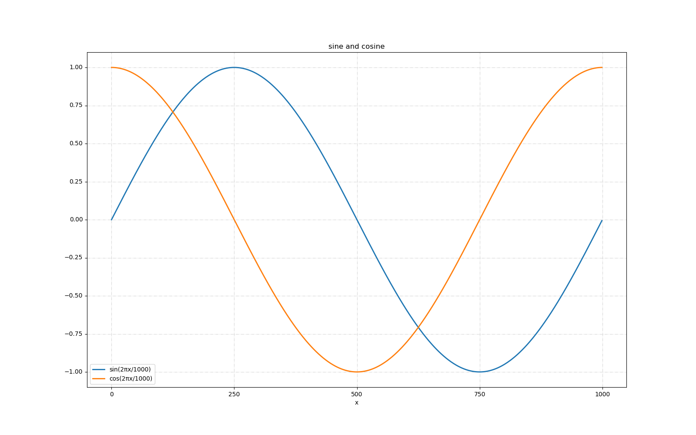
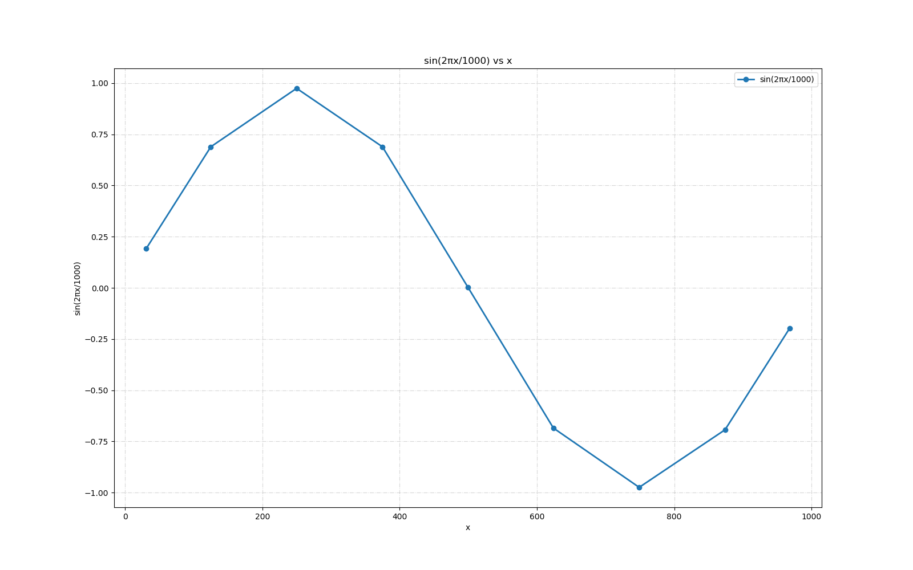
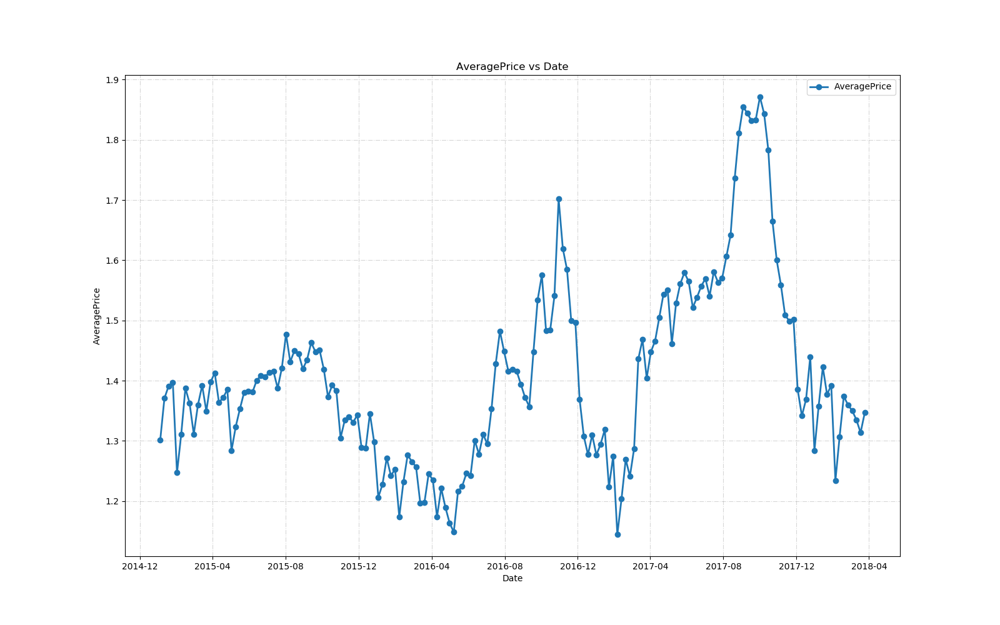

# graph-cli

A CLI utility to create graphs from CSV files.

`graph-cli` is designed to be highly configurable for easy and detailed
graph generation. It has many flags to acquire this detail and uses
reasonable defaults to avoid bothering the user. It also leverages
chaining, so you can create complex graphs from multiple CSV files.

## Examples

```
graph-cli samples/sine.csv -o sine.png
```



```
graph-cli samples/sine.csv --chain  \
| graph-cli samples/cosine.csv --title 'sine and cosine' \
  --ylabel '' --xscale 250 -o sine-cosine.png
```

```
graph-cli samples/sine-cosine.csv -y 2,3 --title 'sine and cosine' \
  --ylabel '' --xscale 250 -o sine-cosine.png
```



```
graph-cli samples/sine.csv --resample 125 -o sine-resample.png
```



```
graph-cli samples/avocado.csv --resample 1W -o avocado-resample.png
```



## Installation

```
pip install graph-cli
```
